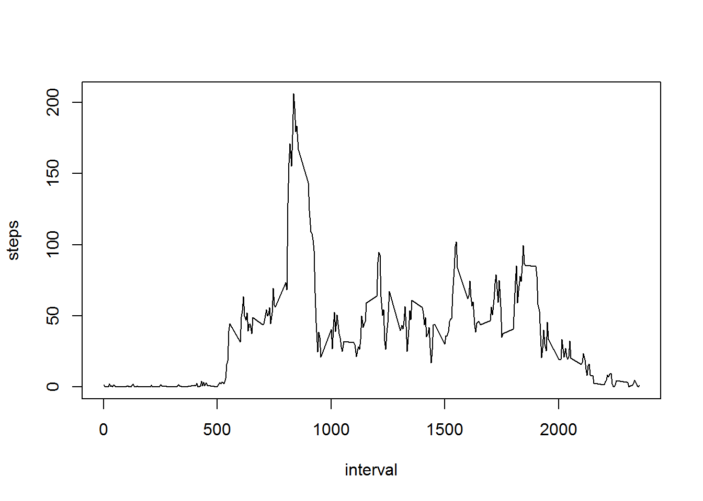

## Loading and preprocessing the data
Load the data and make the date a date type.

```r
rm(list=ls(all=TRUE))
actdat <- read.csv("activity.csv", na.strings = "NA", header = TRUE)
actdat$date <- as.Date(actdat$date)
```

## What is mean total number of steps taken per day?


```r
TotalSteps <- aggregate(steps~date, data=actdat, sum, na.rm=TRUE)
hist(TotalSteps$steps, breaks=10)
```


```r
meansteps <- mean(TotalSteps$steps)
mediansteps <- median(TotalSteps$steps)
```
The mean steps is 10766.19.  
The median steps is 10765.  

## What is the average daily activity pattern?

```r
DayInterval<-aggregate(steps~interval,data=actdat,mean,na.rm=TRUE)
plot(steps~interval,data=DayInterval,type="l")
```



```r
theDay <- DayInterval[which.max(DayInterval$steps),]$interval
```
The interval that has the most steps is 835.  

## Imputing missing values
I will assume missing intervals are 0 steps.  There is no real good way to do it other than this since we don't know if the device is malfuncitoning or just off and if the person is really walking.


```r
missing <- sum(is.na(actdat$steps))

actFill <- actdat
actFill[is.na(actFill$steps), "steps"] <- 0

TotalSteps <- aggregate(steps~date, data=actFill, sum, na.rm=TRUE)
hist(TotalSteps$steps, breaks=10)
```


```r
fillMean <- mean(TotalSteps$steps)
fillMedian <- median(TotalSteps$steps)
```

Total missing values is 2304.  
The filled in mean is 9354.23 and the non-filled is is 10766.19.  
The filled in median is 10395 and the non-filled is is 10765.  
Filling in the data alters the mean and median by adding vaules that move the mean and median.  

## Are there differences in activity patterns between weekdays and weekends?


```r
daytype = function(x)
			{
				if(x %in% c('Saturday', 'Sunday')){
						return('Weekend')
				}

				return('Weekday')
			}
		
actFill$dayname = weekdays(actFill$date)	
actFill$daytype <- as.factor(apply(as.array(actFill$dayname), 1, FUN=daytype))

avgDayType = aggregate(steps~interval+daytype, actFill ,mean)

library(lattice)
xyplot(steps~interval|factor(daytype),data=avgDayType, aspect=1/2,type="l")
```


